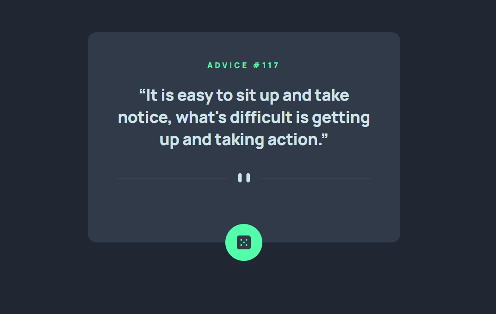

# Advice generator app solution

This is a solution to the [Advice generator app challenge on Frontend Mentor](https://www.frontendmentor.io/challenges/advice-generator-app-QdUG-13db). Frontend Mentor challenges help you improve your coding skills by building realistic projects.

<h1 style="text-align: center;"><a href="https://slimani-ce.github.io/advice-generator-app">Live Site</a> | <a href="https://github.com/Slimani-CE/advice-generator-app">Solution</a></h1>

## Table of contents

- [Advice generator app solution](#advice-generator-app-solution)
  - [Table of contents](#table-of-contents)
  - [Overview](#overview)
    - [The challenge](#the-challenge)
  - [Author](#author)
  - [Contributing](#contributing)
  - [Show Your Support](#show-your-support)

## Overview

### The challenge

Users should be able to:

- View the optimal layout for the app depending on their device's screen size
- See hover states for all interactive elements on the page
- Generate a new piece of advice by clicking the dice icon

## Author
Website - [here](https://slimani-ce.github.io/)
Frontend Mentor - [@Slimani-CE](https://www.frontendmentor.io/profile/Slimani-CE)
Twitter - [@mstapha4real](https://twitter.com/mstapha4real)

## Contributing
Contributions are always welcome! If you find any issues with the code or have suggestions for improvements, please feel free to submit a pull request.

Just remember, we are not responsible for any broken keyboards or late-night coding sessions that may result from your contributions! 😄

## Show Your Support
If you found this notebook helpful, please give it a ⭐️ to show your support!